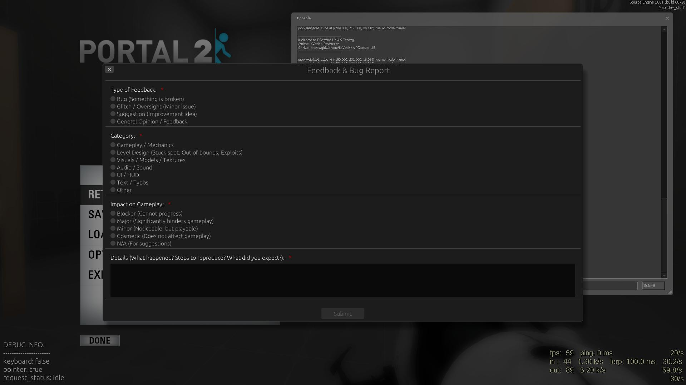
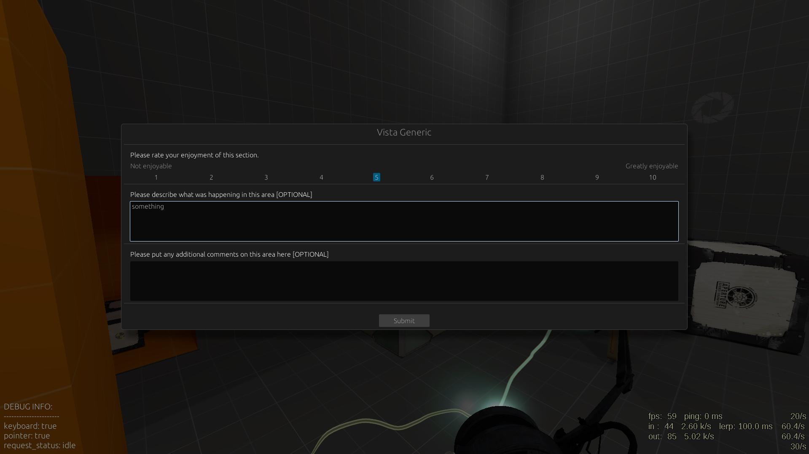
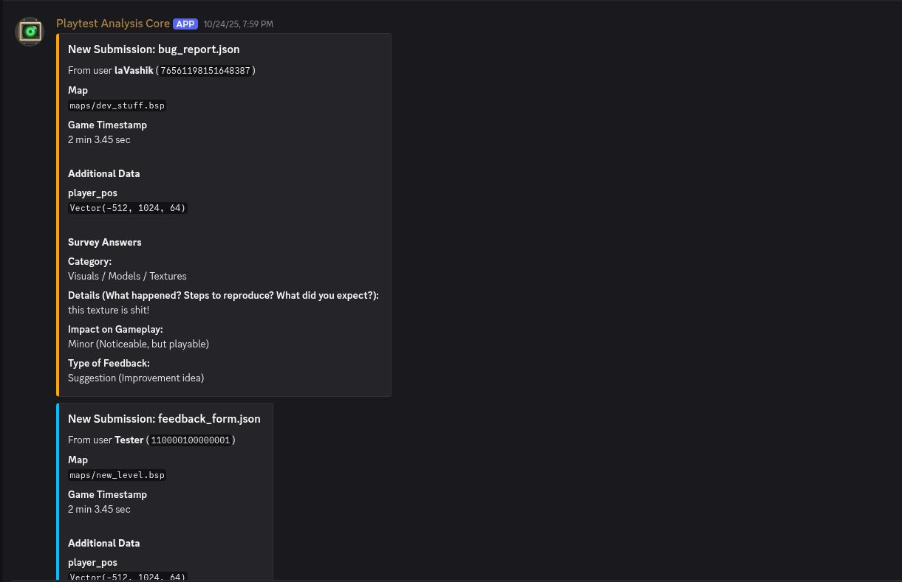

# Portal 2 Playtest Tool

[](https://opensource.org/licenses/MIT)
[](https://www.rust-lang.org/)
[](https://www.microsoft.com/windows)
[](https://developer.valvesoftware.com/wiki/Source)

The **Portal 2 Playtest Tool** is a server-side plugin for **Portal 2** and Source-based mods that lets developers and level designers collect structured feedback directly in-game. Playtesters do not need any additional software: feedback and bug reports are sent straight to your Discord server via the **Playtest Analysis Core** bot.

> [!NOTE]
> This overlay does **not** support Portal 2: Community Edition (P2:CE). For a detailed explanation, please see the [P2:CE Support Notice](P2CE_SUPPORT.md).

## ⚡ Quickstart

1. Download `server_plugin.zip` from the [Releases](https://github.com/LaVashikk/portal2-playtest-tool/releases) page.
2. Extract it into your `Portal 2/<portal2_or_mod>/addons/` folder.
3. Invite the ["Playtest Analysis Core"](https://discord.com/oauth2/authorize?client_id=1427031735429894255) Discord bot and run `/generate_key` in the channel where you want to receive feedback.
4. Put the generated key into `addons/survey/config.json` as `"mod_key"`.
5. Launch the game: playtesters can report issues via the pause-menu **"❗"** button.

## Showcase

*Bug report form accessible from the pause menu.*


*The default survey form.*


*Example of a feedback submission in Discord.*


## Installation and Setup

### 1. Download the Plugin

Go to the [Releases](https://github.com/LaVashikk/portal2-playtest-tool/releases) page and download the latest `server_plugin.zip` file.

### 2. Install the Plugin Files

Extract the contents of `server_plugin.zip` into the `addons` directory of your game or mod.

**Path pattern:**

```
.../steamapps/common/Portal 2/<portal2_or_mod>/addons/
```

**Examples:**

Portal 2:
```
.../steamapps/common/Portal 2/portal2/addons/
```

Custom mod:
```
.../sourcemods/pcapture/addons/
```

After extraction, your `addons` folder should contain:

- `playtest_assistant.dll`
- `overlay.vdf`
- `survey/` (directory with configuration and survey JSON files)

### 3. Set Up the Discord Bot

The **Playtest Analysis Core** bot relays all in-game submissions to Discord.

1. **Invite the bot** to your server:
   https://discord.com/oauth2/authorize?client_id=1427031735429894255

2. In the channel where you want to receive feedback, run:
   ```
   /generate_key
   ```
   The bot will respond with a unique **moderator key** for that channel.

Notes:

- The key is tied to the channel where you run `/generate_key`. All feedback using this key will appear in that channel.
- You can generate multiple keys for different channels if needed (e.g. separate channels for different mods/maps).

### 4. Configure the Plugin

Edit the configuration file:

**File:**
```
.../addons/survey/config.json
```

**Minimal content:**
```
{
  "mod_key": "PASTE_YOUR_KEY_FROM_THE_BOT_HERE"
}
```

Save the file. Setup is complete; you can now start the game or your mod.

---

## Usage

### For Playtesters: Reporting a Bug

1. Pause the game.
2. A **"❗"** button will appear in the bottom-right corner of the pause menu.
3. Click it to open the **Feedback & Bug Report** form.
4. Fill in the form and submit. The report, along with context (map, position, etc.), will be sent to the configured Discord channel.

### For Level Designers: Triggering Surveys

You can open survey windows using a console command, which can be fired:

- Manually from the developer console.
- From in-game entities such as `point_clientcommand`, `trigger_multiple`, etc.

#### Open the default survey

The default survey is typically defined in `addons/survey/default.json`.

```
open_survey 1
```

#### Open a custom survey file

```
open_survey your_custom_survey
open_survey your_custom_survey.json
open_survey survey/your_custom_survey.json
```

**Important constraints:** The JSON file must exist under:
```
.../addons/survey/
```

**Recommended workflow:**

1. Place your custom survey file under `addons/survey/`.
2. Validate the JSON via any online JSON validator.
3. Test the survey by running `open_survey survey/your_file` manually in the console.
4. Only then hook the command up to map triggers.

## Survey Configuration Format

Survey forms are defined in JSON files under `addons/survey/`. The plugin reads these files and builds the in-game UI dynamically.

### Basic structure

```json
{
  "title": "Feedback & Bug Report",
  "widgets": [
    {
      "type": "Header",
      "text": "Section 1: Details"
    },
    {
      "type": "RadioChoices",
      "text": "Type of Feedback:",
      "choices": [ "Bug", "Suggestion", "General Opinion" ],
      "required": true
    },
    {
      "type": "Essay",
      "text": "Details (What happened? Steps to reproduce? What did you expect?):",
      "required": true
    }
  ]
}
```

**Fields:**

- `title` *(string, optional)* – Title displayed at the top of the survey window.
- `widgets` *(array, required)* – List of UI elements (questions/fields).

Each item in `widgets` is a **widget**. Supported widget types are described below.

---

## Supported widget types

### 1. `Header`

Displays a centered title for creating sections within a form.

```json
{
  "type": "Header",
  "text": "Section 1: Overall Experience"
}
```

- `type` – must be `"Header"`.
- `text` *(string, required)* – The section title to display.

### 2. `TextBlock`

Displays a block of read-only, styled text. Useful for instructions or introductions.

```json
{
  "type": "TextBlock",
  "text": "Thank you for participating. Your feedback is crucial for improving the game."
}
```

- `type` – must be `"TextBlock"`.
- `text` *(string, required)* – The content of the text block.

### 3. `Separator`

Adds a blank block to visually separate sections of the form.

```json
{
  "type": "Separator"
}
```
- `type` – must be `"Separator"`. This widget has no other properties.

### 4. `RadioChoices`

Single-choice question with multiple options (radio buttons).

```json
{
  "type": "RadioChoices",
  "text": "Type of Feedback:",
  "choices": [
    "Bug (Something is broken)",
    "Glitch / Oversight (Minor issue)",
    "Suggestion (Improvement idea)"
  ],
  "required": true
}
```

- `type` – must be `"RadioChoices"`.
- `text` *(string, required)* – Question text shown to the player.
- `choices` *(array of strings, required)* – List of options; exactly one can be selected.
- `required` *(boolean, optional)* – If `true`, the player must select a value to submit the form.

### 5. `Checkboxes`

Multiple-choice question where a user can select any number of options.

```json
{
  "type": "Checkboxes",
  "text": "Did you experience any of the following issues? (Select all that apply)",
  "choices": [
    "Frame rate drops",
    "Visual glitches",
    "Incorrect sounds",
    "Game crash"
  ],
  "required": false
}
```

- `type` – must be `"Checkboxes"`.
- `text` *(string, required)* – Question text.
- `choices` *(array of strings, required)* – List of options that can be selected.
- `required` *(boolean, optional)* – If `true`, at least one option must be selected.

### 6. `Essay`

Multiline free-text input for detailed responses.

```json
{
  "type": "Essay",
  "text": "Details (What happened? Steps to reproduce? What did you expect?):",
  "required": true
}
```

- `type` – must be `"Essay"`.
- `text` *(string, required)* – Prompt for the text field.
- `required` *(boolean, optional)* – If `true`, the field cannot be left empty.

### 7. `OneToTen`

Numeric rating question from 1 to 10, with labels at the ends.

```json
{
  "type": "OneToTen",
  "text": "Please rate your enjoyment of this section.",
  "label_at_one": "Not enjoyable",
  "label_at_ten": "Greatly enjoyable",
  "required": true
}
```

- `type` – must be `"OneToTen"`.
- `text` *(string, required)* – Question text.
- `label_at_one` *(string, optional but recommended)* – Label for the “1” end of the scale.
- `label_at_ten` *(string, optional but recommended)* – Label for the “10” end of the scale.
- `required` *(boolean, optional)* – If `true`, the player must select a value.

---

## Writing custom surveys

1. Create a new file in `addons/survey/`, for example:
   ```
   addons/survey/chapter1_intro.json
   ```
2. Define the survey using the schema above:
   - Set a `title`.
   - Add one or more `widgets` with supported `type` values.
   - Make sure `choices` arrays are non-empty for `RadioChoices`.
3. Validate the JSON (no trailing commas, proper quotes, etc.).
4. In-game, open it via:
   ```
   open_survey survey/chapter1_intro.json
   ```

**Tips:**

- Keep questions short and concrete.
- Use `Header` and `Separator` to structure long forms.
- Use `RadioChoices` and `Checkboxes` for classification and quick answers.
- Use `Essay` for context and detailed explanations.
- Use `OneToTen` for measuring player perception (difficulty, enjoyment, clarity).

## Troubleshooting

todo

## License

This project is licensed under the MIT License – see the [LICENSE](LICENSE) file for details.
